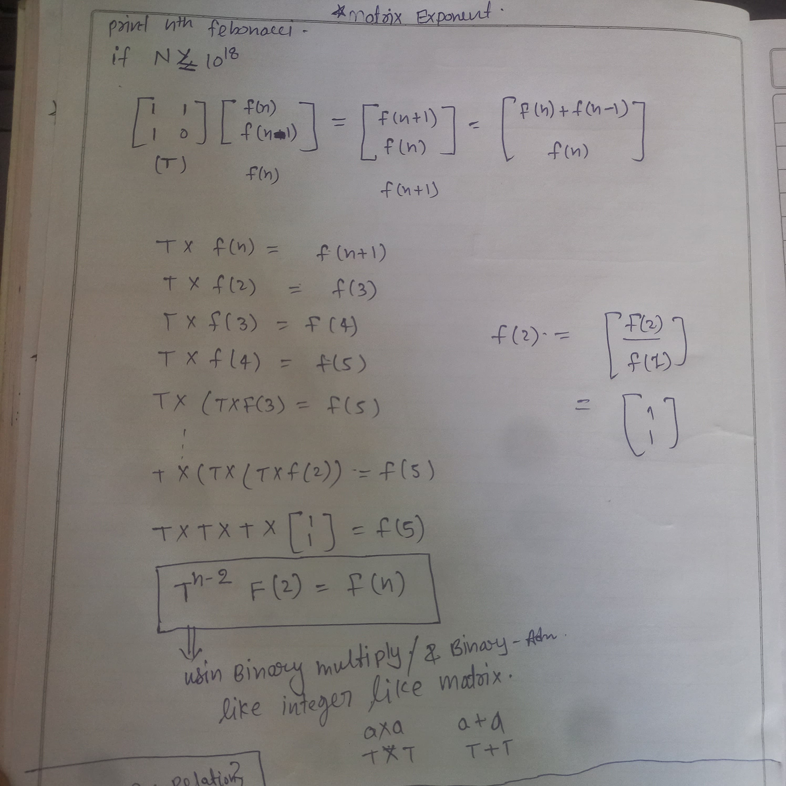
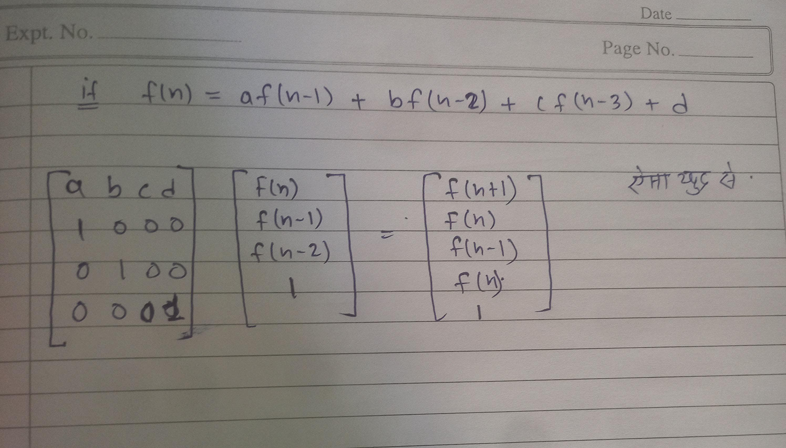
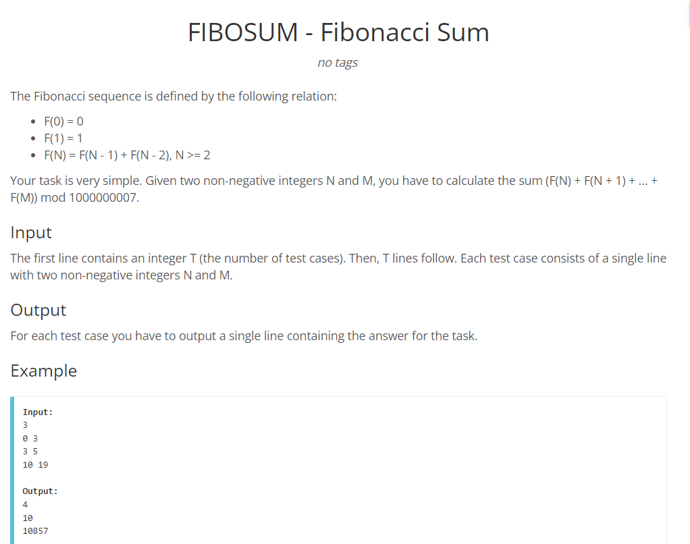
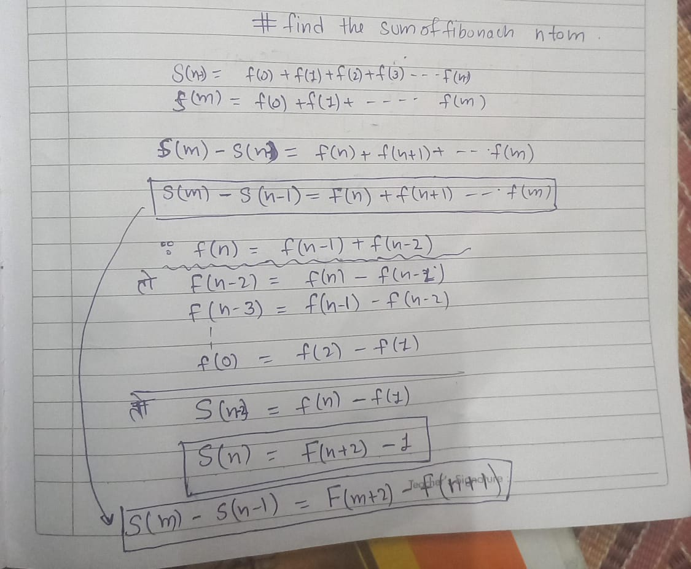
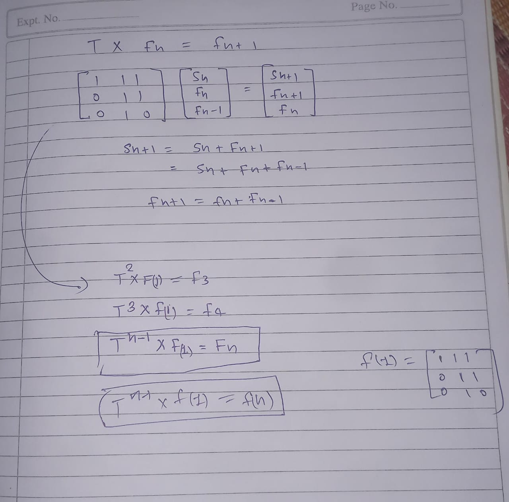

# BIG Integers
> in regular data type we can store 18 Digit
## How to store 100 digit number
> Method 1 -> Using Array

> Method-2 -> Using String (char array) 

## Add Number str1 = "12326737468347683468437", str2 = "8734087430870348704"

```cpp
string str1 = "12326737468347683468437", str2 = "8734087430870348704";
int i = str1.size() - 1, j = str2.size() - 1, carry = 0;
    string ans;

    while (i >= 0 || j >= 0 || carry)
    {
        int sum = carry;
        if (i >= 0)
            sum += str1[i--] - '0';
        if (j >= 0)
            sum += str2[j--] - '0';

        ans += (sum % 10) + '0';
        carry = sum / 10;
    }
    reverse(ans.begin(), ans.end());
    cout << ans;
```
# Find the large factorial 
```cpp
string multiply(string str, int i)
{
    int j = str.size() - 1, carry = 0;
    string ans = "";
    while (j >= 0 || carry)
    {
        int mul = 0;
        if (j >= 0)
        {
            mul = str[j--] - '0';
            mul *= i;
        }
        mul += carry;
        ans += (mul % 10) + '0';
        carry = mul / 10;
    }
    reverse(ans.begin(), ans.end());
    return ans;
}
int main()
{
    int n = 200;
    string ans = "1";
    for (int i = 2; i <= n; i++)
    {
        ans = multiply(ans, i);
    }
    cout << ans;
}
```
### in Python
can work normaly.
```py
n = 112
ans = 1
for i in range (1,n+1):
    ans*=i
print(ans)
```
# Problem
> x + y  = N , y = x + K , find x and y if
N and K <= 10^100
 
- solve 
by solving x = (n-K)/2 and y = x + K;

```cpp
// code for division of two string
// code for additon of two string 
// code for differences of two string
```


# Inclusion And Exclution ---> # Important
- |A U B|  ==  A + B - |A ∩ B|
- |A U B U B|  ==  A + B + C - |A ∩ B| - |B ∩ C| - |A ∩ C| + |A ∩ B ∩ C|

> Note -> Negative sign for the Even Size and Possitive sign for the ODD Size


- you have to find the number of way , of 3 child group 's names has 
  at vowel is commen

 ### Approch -->
 in which we see the total ans of common A , Common E , Common I, Common O , Common U , and have to remove which count Common A and B both like 
 ... in all of them.

 ### Formula 
 | A ∪ E ∪ I ∪ O ∪ U | == for odd +ve for Even size Negative 


## steps
- input 
- write code for store all the combination of vowel frequency

```cpp
#include <bits/stdc++.h>
using namespace std;

// generate subset

vector<string> subsets(string s)
{
    int sz = (1 << s.size());
    vector<string> ans;
    for (int mask = 0; mask < sz; mask++)
    {
        string subset;
        for (int bit = 0; bit < s.size(); bit++)
        {
            if (mask & (1 << bit))
                subset.push_back(s[bit]);
        }
        if (subset.size())
            ans.push_back(subset);
    }
    return ans;
}
// end subsets
int main()
{
    // input start
    int t;
    cin >> t;
    while (t--)
    {
        int n;
        cin >> n;
        string str[n];
        for (int i = 0; i < n; i++)
            cin >> str[i];

        // input end
        unordered_map<string, int> mp;

        for (int i = 0; i < n; i++)
        {
            // all distinct vowel's store in a set dist_vowel in a string
            set<char> dist_vowel;
            for (auto ch : str[i])
            {
                if (ch == 'a' || ch == 'e' || ch == 'i' || ch == 'o' || ch == 'u')
                    dist_vowel.insert(ch);
            }
            // dist_vowel's make a string
            string vowel_str;
            for (auto ch : dist_vowel)
                vowel_str.push_back(ch);

            // take all the subset which is possible by vowel_str

            vector<string> all_subsets = subsets(vowel_str);

            // and store all the subset in the hsh map
            for (auto vowel_subset : all_subsets)
                mp[vowel_subset]++;
        }

        // for (auto x : mp)
        //     cout << x.first << " " << x.second << endl;


  // Main Logic Exclution Exclution for this question
  long long ans =0;
  for(auto &pr :mp){
    if(pr.second<3) continue;
    long long cnt = pr.second;
    // no of ways -- > nC3
    long long ways = ct*(ct-1)(ct-2)/6;
    // if even size odd then +ve i even than -ve
   if(pr.first.size()%2==0)ans -= way;
   else ans += way;
  }

  cout<<ans<<endl;
    }
}
```
# Find the total numberr witch are the less than 500 and divisible by the first 3 prime number
first three prime {2,3,5}
- N(2)--- 500/2 = 250
- N(3) --- 500/3 = 166
- N(5) --- 500 / 5 = 100
- N(2,3) -- 500  / 6 = 83
- N(2,5) --  500 / 15 = 50
- n(3,5) -- 500/ 15 = 33
- N(2,3,5) -- 500/30 = 18

|2 U 3 U 5 | == 250 + 166 + 100 - 83 -50 - 33 +18

# Find the total number witch are the less than 10^18 and divisible by the first 10 prime number

```cpp
vector<int> prime{2, 3, 5, 7, 11, 13, 17, 19, 23, 29};

// make all possible sunsets
long long  ans = 0;
for (int i = 0; i < (1 << prime.size()); i++)
{
    long long lcm = 1;
    for (int bit = 0; bit < prime.size(); bit++)
    {
        if ((i >> bit) & 1)
            lcm *= prime[bit];
    }
    // chack this in b/E even or odd elment
    if (__builtin_popcount(i) % 2 == 0)
        ans -= lcm;
    else
        ans += lcm;
}
cout<<ans;
```

> # UDMY #IMPORTANT

# power function
2^13 = 2*(1101) = 2^8 * 2^4 * 2^1
only bit is set than multiply

```cpp
int powr(int a ,int b){
    int res = 1;
    while(b){
        if(b&1)res *= a;
        a *= a;
        b /=2;
    }
    return result;
}
// O(log(b))
```
## use Modulo 
12^100000 like question
```cpp
#define int long long int 
int mod = 1e9+7;  
int powr(int , int b){
    int res =1 ;
    while(b){
        if(b&1) res *= a, res %= mod;
        a *= a ; a %= mod;
        b /= 2; 
    }
    return res;
}
```
> # a,b,c <= 10^15 than find (a*b)%c
### Approch 1 ❎❎❎
direct (a*b)%c this, its give give a worng answer
### Approch 2 ❎❎❎
(a%c*b%c)%c give worng answer
### Approch 3 broute force ✅
using for loop and add a , b time 
at each step take the modulo
### Approch 4 (using Binary multiplication)
```cpp
#define int long long int 
int BinMult(int a , int b ,int c){
    int res = 0;
    while(b){
        if(b&1) res += a , res %=c;
        a +=a ;
        a %= c;
        b /= 2;
    }
    return res;
}
// O(log(b))
```
> # Print Nth Febonachi number if
## if N<=10^6 Dp code work fine using take mod(%)
but
# IMPORTANT
> ## if N <= 10^18 #IMPORTANT
Matrix Exponent




```cpp
#include <bits/stdc++.h>
using namespace std;
#define int long long int

const int sz = 2;
const int mod = 1e9 + 7;
// make matrix structure
struct Mat
{
    int m[sz][sz];
    // constructer
    Mat()
    {
        memset(m, 0, sizeof(m));
    }
    // identity Matrix
    void identity()
    {
        for (int i = 0; i < sz; i++)
            m[i][i] = 1;
    }
    // multiplication of matrix O(sz^3) -- O(8)
    Mat operator*(Mat a)
    {
        Mat res;
        for (int i = 0; i < sz; i++)
        {
            for (int j = 0; j < sz; j++)
            {
                for (int k = 0; k < sz; k++)
                {
                    res.m[i][j] += (m[i][k] * a.m[k][j]);
                    res.m[i][j] %= mod;
                }
            }
        }
        return res;
    }
};

int Fib(int n)
{
    // make result
    Mat res;
    res.identity();
    // make T matrix
    Mat T;
    T.m[0][0] = T.m[0][1] = T.m[1][0] = 1;

    if (n <= 2)
        return 1;
    // using Binary Exp . find the power of T^n-1,  O(log(n))
    n -= 2;
    while (n)
    {
        if (n & 1)
            res = res * T;
        T = T * T;
        n /= 2;
    }
    return (res.m[0][0] + res.m[0][1]) % mod;
}
// main function
int32_t main()
{
    int n = 1202;
    cout << Fib(n);
}
```
# find the sum of fibonaci serise from n to m


## Method -1 --> 

s(n-1) = f(0) + f(1) + f(2) + f(3) + ------ + f(n-1)

s(m) = f(0) + f(1) + f(2) + f(3) + ------ + f(n)

subtruct them

s(m) - s(n-1)  = s(n----m) = this will be the ans 

##  IMPORTANT
 
  f(n) = f(n-1) + f(n-2)
so
  f(n-2) = f(n) - f(n-1)
  f(n-3) = f(n-1) - f(n-2)
  f(n-4) = f(n-2) - f(n-3)
  f(n-5) = f(n-3) - f(n-2)
  .
  .
  .
  f(0) = f(2) - f(1) 

add all

S(n-2) =  f(n) - f(1)
> ## S(n) = f(n+2) - 1
so 
for this problem
> ##  S(m) - S(n-1) = F(m+2) - F(n+1 )


by using upper code 
```cpp
int32_t main(){
    int n,m;
    cin>>n>>m;
    int ans = (fib(m+2)-fib(n+1))%mod;
    cout<<ans;   
}
``` 
> ## Method -2 ONLY Matrix Exponent Apply



```cpp
#include<bits/stdc++.h>
#define int long long int
using namespace std;

const int mod = 1e9 + 7;
const int sz = 3;

struct Mat {
	int m[sz][sz];
	Mat() {
		memset(m, 0, sizeof(m));
	}
	void identity() {
		for (int i = 0; i < sz; i++) {
			m[i][i] = 1;
		}
	}
	Mat operator* (Mat a) {
		Mat res;
		for (int i = 0; i < sz; i++) {
			for (int j = 0; j < sz; j++) {
				for (int k = 0; k < sz; k++) {
					res.m[i][j] += m[i][k] * a.m[k][j];
					res.m[i][j] %= mod;
				}
			}
		}
		return res;
	}
};

int Fibosum(int n) {
	// base case
	if (n == -1) return 0;
	if (n == 0) return 0;
	if (n == 1) return 1;

	Mat res;
	res.identity();
	Mat T;
	T.m[0][0] = T.m[0][1] = T.m[0][2] = 1;
	T.m[1][1] = T.m[1][2] = 1;
	T.m[2][1] = 1;

	// n >= 2
	n -= 1;

	// log(n)
	while (n) {
		if (n & 1) res = res * T;
		T = T * T;
		n /= 2;
	}

	return (res.m[0][0] + res.m[0][1]) % mod;
}

int32_t main()
{
	

	int t;
	cin >> t;

	while (t--) {
		int n, m;
		cin >> n >> m;
		cout << (Fibosum(m) - Fibosum(n - 1) + mod) % mod << '\n';
	}

	return 0;
}
```

---
> # By-LUV 
---
 # Gcd , O(logN)
```cpp
int Gcd(int a , int b){
    // if(b==0)return a;
    if(a%b==0)return b;
    else return (b,a%b);
}
```
```cpp
__gcd(12,18); // or
gcd(13,52);
``` 


# Binay Exponentiation -

> pow(a,b) return ans in double data type it high chance of error in prision

## Using recrsion O(logb)

```cpp
 int BinaryExpon(int a , int b){
    if(b==1)return 1;
    int res = BinaryExpon(a,b/2);
    if(b%2==1)
    return a*res*res;
    else
    return res*res;
}
```

if Modulo M = 1e9+7

```cpp
int M = 1e9+7;
int BinaryExpon(int a , int b){
    if(b==1)return 1;
    int res = BinaryExpon(a,b/2);
    if(b%2==1)
    return (a*((res*1LL*res)%M))%M;
    else
    return (res*1LL*res)%M;
}
```

## using Itreation

let 5^13 , than we take binary of 13 (1101) and we multiply all the power of 5 where binary is 1 menas === 5^8 _ 5^4 _ 5^1

```cpp
int BinaryExp(int a, int b) {
    int ans = 1;
    while (b) {
        if (b & 1) {
            ans = (ans * a) % M;
        }
        a = (a * a) % M;
        b >>= 1;
    }
    return ans;
}
```

if M = 1e9+7 than

```cpp
int M = 1e9 + 7;
int BinaryExp(int a, int b) {
    int ans = 1;
    while (b) {
        if (b & 1) {
            ans = (ans * 1LL * a) % M;
        }
        a = (a * 1LL * a) % M;
        b >>= 1;
    }
    return ans;
}
```

# Large Exp # IMPORTANT HAI 

in binary Exponent between a and b value is **int** , a&b&M<=10^9

> # IF a<=10^18 or a<=2^1024
>
> in this case , a can be reduce a

# a^b % M = ((a%M)^b)%M

> # if M>=10^18
>
> in this case when we calculate
> a = (a\*a)%M it overflow the long long range
> so that use use the

### **Binary Multiplication**

menas , can't multiply directily so use this ,
in b/w --> 5\*4 means ---> 5 + 5 + 5 + 5

> a\*a = a+a+a+.... a time
> a+a<10^18 so (a+a)%M each step

but we use binary addition for multiplication
in log(n) time complexity
5*13 = 5*(1101) = 5(8+4+0+1)

```cpp

//1. main function for claculate the binary Exp
long long BinaryExp(long long a , long long b , long long M){
    long long ans = 1;
    while(b>0){
    if(b&1){
        ans = BinaryMultiply(ans,a,M);
    }
    a = BinaryMultiply(a,a,M);
    b >>=1;}
    return ans;
}
// 2.function for binary multiply
// but in Log(n) complexity
long long BiaryMultiply(long long a ,long long b , long long M){
    long long ans =0;
    while(b>0){
    if(a&1){
        ans = (ans+a)%M;
    }
    a = (a +a)%M;
    b >>= 1;
    }
    return ans;
}
```

# Large Exp , eural theuram 
> # when b>=10^18 


